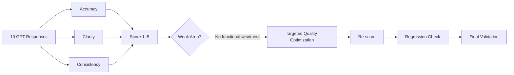

<!-- SHOWCASE_START --><div align="center">[](https://github.com/shaikshahid777/ai-job-application-assistant-gpt-evaluation)

[](https://github.com/shaikshahid777/ai-job-application-assistant-gpt-evaluation) [](https://github.com/shaikshahid777/ai-job-application-assistant-gpt-evaluation/issues/new) [](https://github.com/shaikshahid777/ai-job-application-assistant-gpt-evaluation/stargazers) [](https://github.com/shaikshahid777/ai-job-application-assistant-gpt-evaluation/fork) [](https://github.com/shaikshahid777)</div>

> ✨ **Project Showcase Mode:** animated banner • interactive navigation • live repository actions

[🚀 Repository](https://github.com/shaikshahid777/ai-job-application-assistant-gpt-evaluation) · [🐞 Report Issue](https://github.com/shaikshahid777/ai-job-application-assistant-gpt-evaluation/issues/new) · [⭐ Star](https://github.com/shaikshahid777/ai-job-application-assistant-gpt-evaluation/stargazers) · [🔱 Fork](https://github.com/shaikshahid777/ai-job-application-assistant-gpt-evaluation/fork) · [👤 Profile](https://github.com/shaikshahid777)

<!-- SHOWCASE_END -->

<div align="center">

# 🤖 AI Job Application Assistant — GPT Evaluation

[](./evaluation_sheet.md)
[](./evaluation_sheet.md)
[](./evaluation_sheet.md)
[](./evaluation_sheet.md)

[](https://github.com/shaikshahid777/ai-job-application-assistant-gpt-evaluation)
[](https://www.loom.com/share/f617a54c269e4a01ab765f749e6a7cfe)
[](https://chatgpt.com/g/g-6ab32eeab8c88191915986ea8efad18d-ai-job-application-assistant)

<a href="https://readme-typing-svg.demolab.com/"></a>

</div>

---

## 🚀 Quick Access

<p align="center">

<a href="./evaluation_sheet.md"></a>
<a href="./optimization_summary.md"></a>
<a href="./evaluation_rescoring.md"></a>
<a href="./Topic_9_Performance_Evaluation_Optimization_Assessment.pdf"></a>

</p>

<p align="center">

<a href="https://chatgpt.com/g/g-6ab32eeab8c88191915986ea8efad18d-ai-job-application-assistant"></a>
<a href="https://www.loom.com/share/f617a54c269e4a01ab765f749e6a7cfe"></a>
<a href="https://github.com/shaikshahid777/ai-job-application-assistant-gpt-evaluation"></a>

</p>

---

## 🎯 Project Overview

This repository documents **Topic 9 — Performance Evaluation & Optimization** for the **AI Job Application Assistant** Custom GPT.

The evaluation measures **Accuracy, Clarity, and Consistency** using a structured 1–5 scoring rubric across **10 representative GPT responses**.

> **Final result: 10/10 responses passed, with 5/5 across all three evaluation metrics.**

---

## 📊 Evaluation Snapshot

| Metric | Score | Status |
|---|:---:|:---:|
| 🎯 Accuracy | **5.0 / 5** | ✅ PASS |
| 🧠 Clarity | **5.0 / 5** | ✅ PASS |
| 🔁 Consistency | **5.0 / 5** | ✅ PASS |
| ⭐ Overall | **5.0 / 5** | ✅ PASS |

---

## 🧪 Evaluation Flow



---

## ⚙️ Optimization Applied

A genuine quality improvement was identified: **Knowledge Guide provenance clarity**.

The instructions were refined so the GPT:
1. States when a topic is not explicitly covered by the Knowledge Guide.
2. Does not attribute undocumented guidance to the Knowledge Guide.
3. Labels additional advice as **general practical guidance**.
4. Keeps documented rules and additional guidance clearly separated.

No artificial failure or weak score was introduced.

---

## 🔄 Before → After Re-Scoring

| Metric | Before | After |
|---|:---:|:---:|
| Accuracy | 5/5 | **5/5** |
| Clarity | 5/5 | **5/5** |
| Consistency | 5/5 | **5/5** |
| Total | 15/15 | **15/15** |

> **Regression check: PASS ✅**

---

## 📁 Repository Structure

```text
ai-job-application-assistant-gpt-evaluation/
│
├── 📄 evaluation_sheet.md
├── 📄 optimization_summary.md
├── 📄 evaluation_rescoring.md
├── 📕 Topic_9_Performance_Evaluation_Optimization_Assessment.pdf
└── 📘 README.md
```

---

## 📚 Deliverables

| Resource | Purpose |
|---|---|
| 📊 [Evaluation Sheet](./evaluation_sheet.md) | Metrics, rubric, and 10-response scoring |
| ⚙️ [Optimization Summary](./optimization_summary.md) | Targeted optimization and rationale |
| 🔄 [Evaluation Rescoring](./evaluation_rescoring.md) | Before/after scoring and regression check |
| 📕 [Assessment PDF](./Topic_9_Performance_Evaluation_Optimization_Assessment.pdf) | Final assessment document |
| 🤖 [Custom GPT](https://chatgpt.com/g/g-6ab32eeab8c88191915986ea8efad18d-ai-job-application-assistant) | Final AI Job Application Assistant |
| 🎥 [Loom Demonstration](https://www.loom.com/share/f617a54c269e4a01ab765f749e6a7cfe) | Topic 9 walkthrough |

---

## 🏆 Final Validation

| Requirement | Result |
|---|---|
| Define Accuracy metric | ✅ |
| Define Clarity metric | ✅ |
| Define Consistency metric | ✅ |
| Evaluate at least 10 responses | ✅ 10 |
| Identify weak areas | ✅ Quality improvement identified |
| Apply targeted optimization | ✅ |
| Re-score previously evaluated response | ✅ |
| Confirm no regression | ✅ 15/15 |
| Document evaluation | ✅ |
| Loom demonstration | ✅ |
| Assessment PDF | ✅ |

---

<div align="center">

### 🚀 Topic 9 Complete

**Measure → Optimize → Re-score → Validate**

[⬆️ Back to Top](#-ai-job-application-assistant--gpt-evaluation)

</div>
