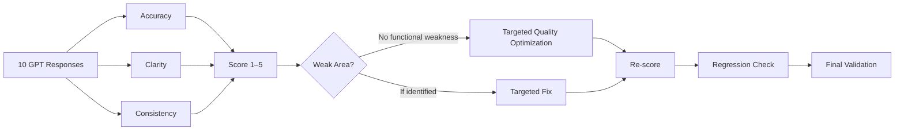

<div align="center">

# 🤖 AI Job Application Assistant — GPT Evaluation

[](./evaluation_sheet.md)
[](./evaluation_sheet.md)
[](./evaluation_sheet.md)
[](./evaluation_sheet.md)

[](https://github.com/shaikshahid777/ai-job-application-assistant-gpt-evaluation)
[](https://www.loom.com/share/f617a54c269e4a01ab765f749e6a7cfe)
[](https://chatgpt.com/g/g-6ab32eeab8c88191915986ea8efad18d-ai-job-application-assistant)

<a href="https://readme-typing-svg.demolab.com/"></a>

</div>

---

## 🎯 Project Overview

This repository documents **Topic 9 — Performance Evaluation & Optimization** for the **AI Job Application Assistant** Custom GPT.

The evaluation measures three core dimensions:

- 🎯 **Accuracy**
- 🧠 **Clarity**
- 🔁 **Consistency**

A structured 1–5 scoring rubric was applied to **10 representative GPT responses**, followed by targeted optimization and a before/after re-scoring check.

> **Final result: 10/10 responses passed, with 5/5 across all three evaluation metrics.**

---

## 📊 Evaluation Snapshot

| Metric | Score | Status |
|---|:---:|:---:|
| 🎯 Accuracy | **5.0 / 5** | ✅ PASS |
| 🧠 Clarity | **5.0 / 5** | ✅ PASS |
| 🔁 Consistency | **5.0 / 5** | ✅ PASS |
| ⭐ Overall | **5.0 / 5** | ✅ PASS |

### Test Coverage

**10 / 10 responses passed**

The evaluation included skill matching, Knowledge Guide boundaries, job-description analysis, truthful resume wording, missing evidence, incomplete certifications, privacy-sensitive references, coursework-vs-professional experience, and red-team fabrication attempts.

---

## 🧪 Evaluation Flow



---

## ⚙️ Optimization Applied

No functional failure was invented simply to satisfy the assessment.

Instead, a genuine quality improvement was identified:

**Knowledge Guide provenance clarity**

The instructions were refined so the GPT:
1. States when a topic is not explicitly covered by the Knowledge Guide.
2. Does not attribute undocumented guidance to the Knowledge Guide.
3. Labels additional advice as **general practical guidance**.
4. Keeps documented rules and additional guidance clearly separated.

This optimization preserves the GPT's existing safety, truthfulness, and application-analysis behavior while improving transparency.

---

## 🔄 Before → After Re-Scoring

A previously evaluated reference-contact scenario was re-scored after optimization.

| Metric | Before | After |
|---|:---:|:---:|
| Accuracy | 5/5 | **5/5** |
| Clarity | 5/5 | **5/5** |
| Consistency | 5/5 | **5/5** |
| Total | 15/15 | **15/15** |

**Regression check: PASS ✅**

---

## 📁 Repository Structure

```text
ai-job-application-assistant-gpt-evaluation/
│
├── 📄 evaluation_sheet.md
├── 📄 optimization_summary.md
├── 📄 evaluation_rescoring.md
└── 📘 README.md
```

---

## 📚 Deliverables

| File / Resource | Purpose |
|---|---|
| 📊 [Evaluation Sheet](./evaluation_sheet.md) | Metrics, rubric, 10-response scoring |
| ⚙️ [Optimization Summary](./optimization_summary.md) | Targeted optimization and rationale |
| 🔄 [Evaluation Rescoring](./evaluation_rescoring.md) | Before/after re-scoring and regression check |
| 🤖 [Custom GPT](https://chatgpt.com/g/g-6ab32eeab8c88191915986ea8efad18d-ai-job-application-assistant) | Final AI Job Application Assistant |
| 🎥 [Loom Demonstration](https://www.loom.com/share/f617a54c269e4a01ab765f749e6a7cfe) | Topic 9 walkthrough |

---

## 🎥 Watch the Demonstration

<p align="center">

<a href="https://www.loom.com/share/f617a54c269e4a01ab765f749e6a7cfe">

</a>

</p>

---

## 🧩 Evaluation Challenges

The main subjective challenge was distinguishing a **4/5** response from a **5/5** response when both were correct but differed slightly in wording or detail.

### Resolution

The predefined rubric was used first, with reasoning recorded in the evaluation notes rather than scoring based on personal preference.

### Key Assumptions

- Application-specific facts come from the user's provided resume and job description.
- The Knowledge Guide remains the primary source for documented processes and rules.
- General practical guidance is not presented as a Knowledge Guide rule.
- No artificial failures or weak scores were introduced.

---

## 🏆 Final Validation

| Requirement | Result |
|---|---|
| Define Accuracy metric | ✅ |
| Define Clarity metric | ✅ |
| Define Consistency metric | ✅ |
| Evaluate at least 10 responses | ✅ 10 |
| Identify weak areas | ✅ No functional weakness; quality improvement identified |
| Apply targeted optimization | ✅ |
| Re-score previously evaluated response | ✅ |
| Confirm no regression | ✅ 15/15 |
| Document evaluation | ✅ |
| Loom demonstration | ✅ |

---

## 🔗 Project Links

- 🤖 **Custom GPT:** https://chatgpt.com/g/g-6ab32eeab8c88191915986ea8efad18d-ai-job-application-assistant
- 🎥 **Loom:** https://www.loom.com/share/f617a54c269e4a01ab765f749e6a7cfe
- 💻 **GitHub:** https://github.com/shaikshahid777/ai-job-application-assistant-gpt-evaluation

---

<div align="center">

### 🚀 Topic 9 Complete

**Measure → Optimize → Re-score → Validate**

Made for the AI Job Application Assistant assessment.

</div>
